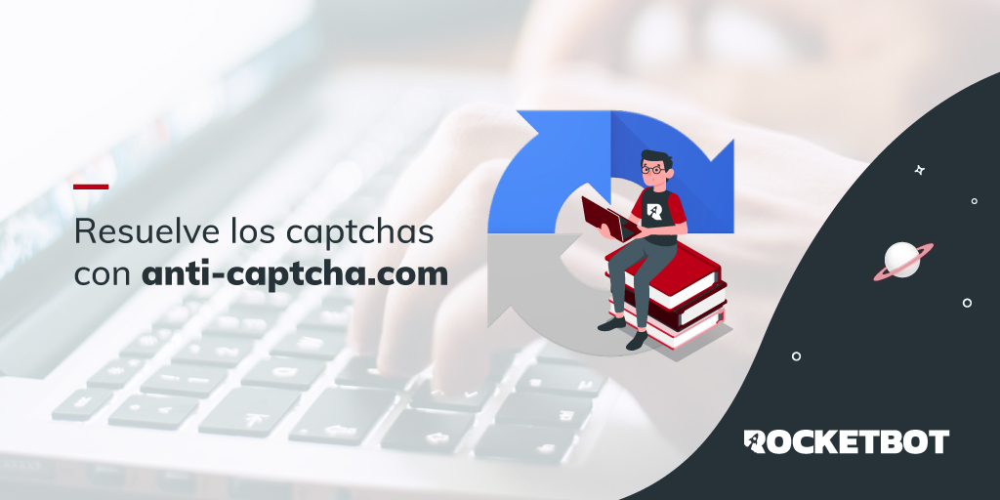

# Anticaptcha
  
Module to resolve captcha with anti-captcha  

*Read this in other languages: [English](Manual_Anticaptcha.md), [Español](Manual_Anticaptcha.es.md), [Portugues](Manual_Anticaptcha.pr.md).*
  

## How to install this module
  
__Download__ and __install__ the content in 'modules' folder in Rocketbot path  

## Description of the commands

### Resolve ReCaptcha
  
Resolve ReCaptcha with an API of https://anti-captcha.com
|Parameters|Description|example|
| --- | --- | --- |
|Key Anticaptcha|Key of your anticaptcha account|Key|
|Url of the page that has ReCaptcha|Url of the page to which the ReCaptcha will be resolved|Url|
|Token ReCaptcha|ReCaptcha Token that is obtained in the page that has ReCaptcha|Token|
|Variable where the Anticaptcha result is stored|Variable where the Anticaptcha result is stored|Variable|

### Resolve Image Captcha 
  
Resolve a Image Captcha with an API of https://anti-captcha.com
|Parameters|Description|example|
| --- | --- | --- |
|Key Anticaptcha|Key of your anticaptcha account|Key|
|Image path|Path to the image to be resolved|C:/Users/User/Desktop/captcha.png|
|Variable where the Anticaptcha result is stored|Variable where the result is stored|Variable|
